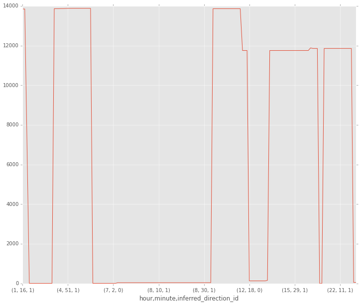
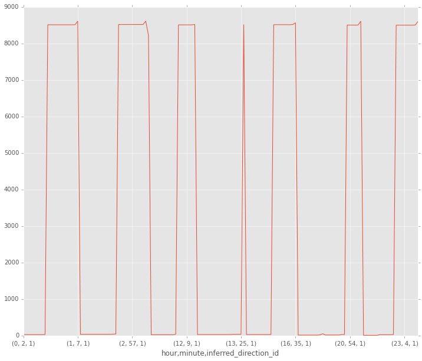

For this analysis, the following filters were applied:

Bus Lines: M15, M10  
Inferred Phase: LAYOVER

Also, the vehicle with highest frequency of rides on that particular day for M15 and M10 were considered for studying the inconsistencies present in the LAYOVER mode. 

Below are the ouptuts of the plots obtained for bus numbers 5624 and 6705 across M15 and M10 buslines respectively. Under this scenario, typically cyclic variations along with time should be observed as bus makes multiple layovers on any given day. The day analysed for this plot is 1 Aug 2014 and data is taken from historical bus mta site. The x-axis of the plots is based on hour, minute and inferred direction id which is an indicator whether the bus is making a to journey or opposite journey. Ideally consistent cycles of layover times should be noticed on the plot.

From the plots, it can be inferred that even in this case Bus 6705 shows a consistent trend across the day with very minute variations whereas Bus 5624 shows more variations in terms of layover times. Further it can be observed that layover times are very small during peak periods which can suggest that M15 is a more busier route in comparison to M10 route. However, in terms of reliability, by looking at cyclic variations in the plots, definitely M10 is more reliable and can be better predicted in comparison to M15.

### Plot output of Bus 5624 in M15 Busline

  

### Plot output of Bus 6705 in M10 Busline

  

