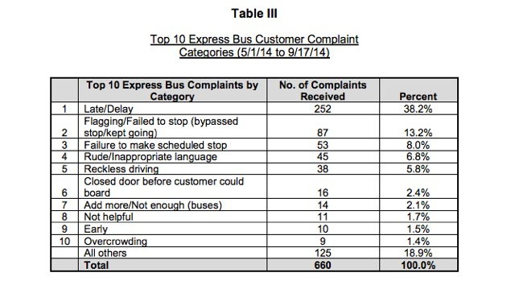

### Problem Context:
NYC MTA Bus agency boasts of largest network of public buses than any other public agency in North America. The bus services are offered 24 hours a day and includes different kinds of services such as local, limited-stop, select bus and express to help city residents commute easily and effectively [1]. In middle of 2015, NYC Bus MTA agency launched Bus Time service that provides time-based bus arrival estimates in addition to distance-based information at any given stop citywide. Surely this kind of system which provides prediction of Bus arrival time is quite useful especially in NYC where city residents heavily rely on public transportation, and this kind of predictive information before hand helps them to plan their trips more efficiently. Bus Time service is possible due to the advancements in Information and Communication Technologies and it uses location data provided by an enhanced global positioning device mounted inside each bus which is further integrated with bus route info, schedules and map files to output the information received by bus customers [2]. On the other hand, according to the NYC's Comptroller audit report on MTA Bus operations, almost 30% of the time the city's express services are late. Additionally, majority of bus complaints made by the customers are due to lateness and delays as shown in the below image [3].

  

One of the reasons to launch the Bus Time service was a committment from NYC MTA Bus agency to address the delayness problem that is existing in current services and also with the hope to improve their operational efficiencies. Currently, Bus Time service offers information about time estimates of a bus's arrival at a queried stop. These time-based estimates take into consideration multiple factors that can affect the arrival time of a bus, such as its schedule, historical travel times, and current traffic conditions. Additionally there are other factors including cyclic variations like time of the day and day of the week, bus dwell time at any given stop and changing weather conditions. In this project, a new framework will be explored to predict the bus arrival times using the earlier discussed factors and then compared with estimates currently predicted by the Bus Time service used by NYC MTA agency. Specific efforts will be made to understand the differences that exist between the results of the Bus Time service and the newly built model.  

### Data Sources
The data taken for the exploratory data analysis is historical data dump available on the MTA web site. Respective link for this is provided below and this data contains archived MTA Bus Time Data from August 1, 2014 through October 31, 2014. Each record in this data set contains, for a single bus, the time of observation, bus location, bus route, next stop, distance from that stop, and other variables described below.

MTA Historical Data Source: http://web.mta.info/developers/MTA-Bus-Time-historical-data.html
MTA Historical Data Field Definitions: http://web.mta.info/developers/resources/nyct/MTA-Bus-Time-fields.htm

However, for the recent years data, MTA has a well-documented API that allows a user to obtain information on any bus line in real time. The positions of all the buses are updated every 30 seconds, and each bus has detailed information on its route, the distance remaining to each stop, and the predicted arrival time at each future station at that point in time.

MTA Bus Time API: http://bustime.mta.info/wiki/Developers/Index

### Exploratory Data Analysis
For initial level analysis more as an effort to understand the fields and their interactions, data for 01 Aug 2014 has been downloaded from the Historical MTA data link. This data itself was in the size of ~800 MB containing location level information for about 300 buses operational on that partiuclar day. In this analysis, majorly incosistencies were looked at, if any by selecting few buslines and high frequent vehicles amongst them. The output plots are shared in separate folders i.e. INPROGRESS_Analysis and LAYOVER_Analysis etc. Below hypotheses were looked into under the performed analysis:
 
1. Would bus vehicles show inconsistencies in schedule during en-route (i.e. ride IN_PROGRESS) more due to external factors like traffic congestion, high dwelling time during a stop etc? 
2. Would bus vehicle show inconsistencies in schedule during rest period (i.e. ride LAYOVER) more due to factors like driver, bus conditions etc?

### References
1. http://web.mta.info/nyct/facts/ffintro.htm
2. http://www.mta.info/press-release/nyc-transit/time-based-arrival-estimates-launch-citywide-mta-bus-time%E2%84%A2
3. http://gothamist.com/2015/04/23/stats_prove_that_select_bus_service.php
